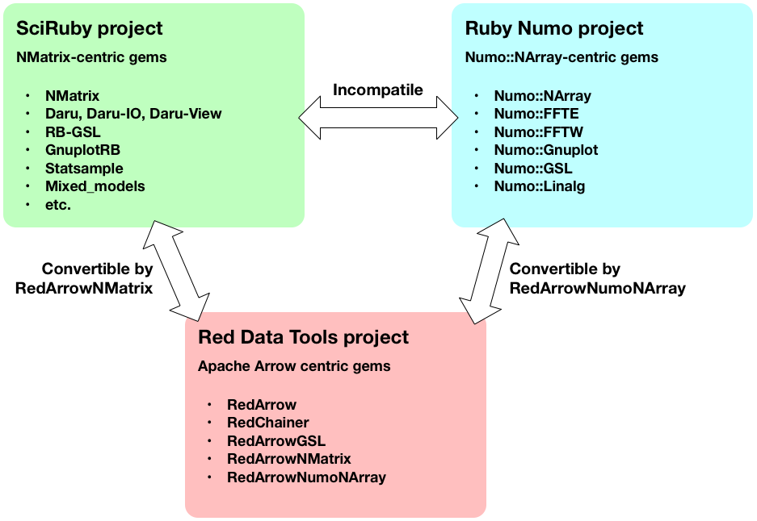
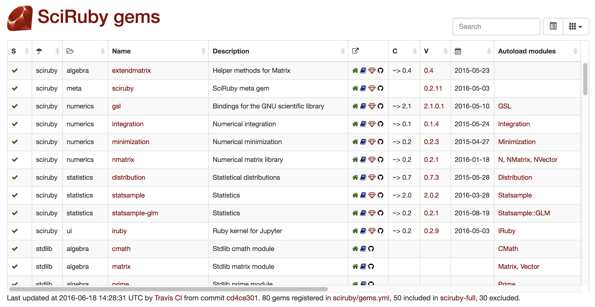
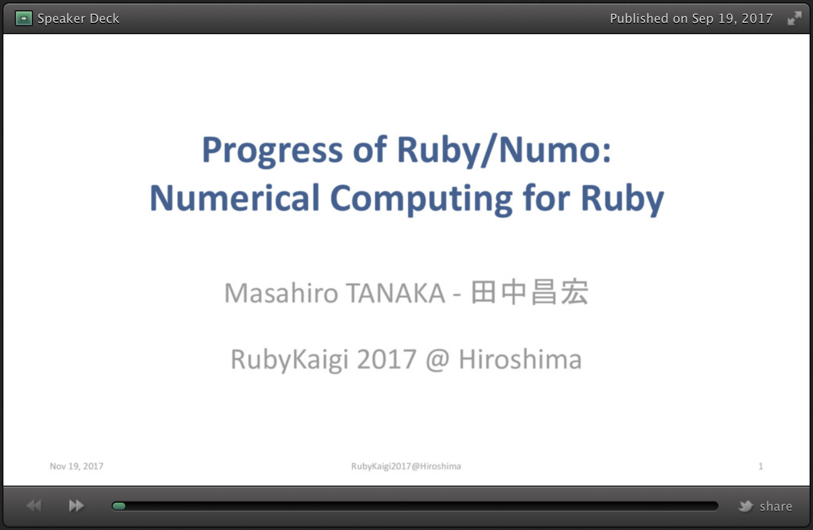
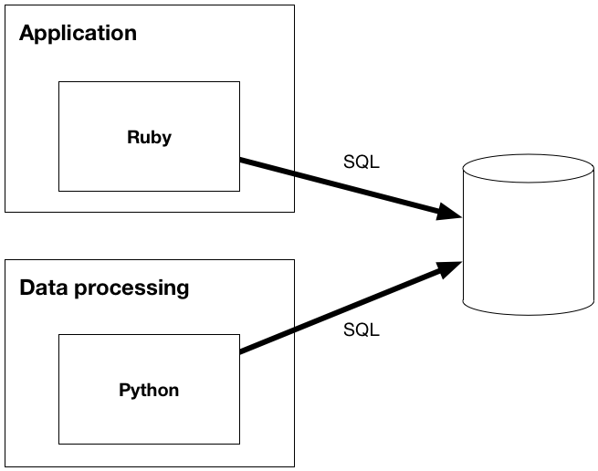
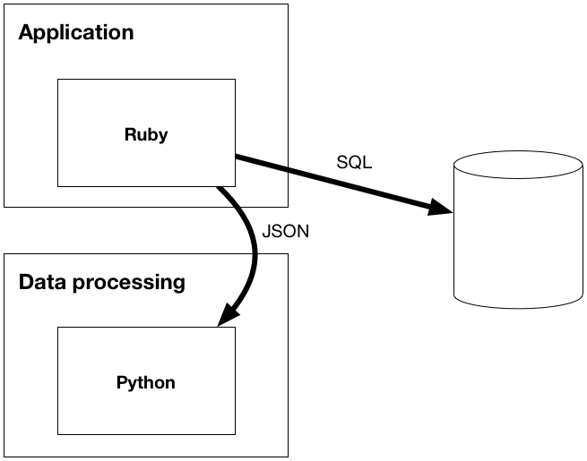
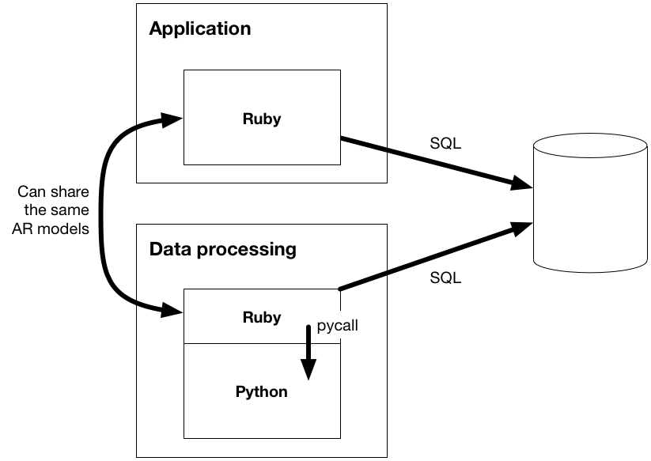

class: title_page, middle
# Using Ruby in data science
## Kenta Murata, Speee Inc.
.speee_logo[
]

Fri, Nov 17, 2017 RubyConf 2017 in New Orleans, LA, US

This Slide is available at https://speakerdeck.com/mrkn/using-ruby-in-data-science

???
Hello everyone.  Thank you for coming.
I'd like to talk about using Ruby in data science.

---
class: middle
# How many people related to data science?

----
- Data scientists
- Data engineers
- Developers of applications that utilize data


???
How many people related to data science?
It includes such as data scientists, data engineers, and data related application engineers.

Not many.

---
class: middle
# We need to be familiar with the way of data utilization

???
Even for us working with Ruby, the opportunities to be involved in data science will increase more and more.

Ruby を使って仕事をしている私たちでも、データサイエンスと関わらなければならない機会がこれからますます増えて行きます。

---
class: middle
# But Ruby hinders us from becoming familiar with data science because Ruby is difficult to use in data science

???
But Ruby hinders us from becoming familiar with data science because Ruby is difficult to use in data science.

でも、Ruby は私たちがデータサイエンスに馴染むのを妨げます。
なぜなら、Ruby はデータサイエンスで使いにくいからです。

---
class: middle
# The situation is changing recently

???
However, it has been so until recently.
This situation is changing.

しかし、そうだったのは最近までです。
この状況は変わりつつあります。

---
class: middle
# Now Ruby is getting easier to use with data science little by little

???
Currently, Ruby is getting easier to use with data science little by little.

Did you know?　Who knew it?

No one knew it.  Don't worry.  No problem.  I'll describe it in this talk.

---
class: middle
# Today I'll talk about how we can use Ruby in data science

???
Today I'll talk about how we can use Ruby in data science.

本日私は、Ruby をどのようにデータサイエンスで使えるかお話しします。

Before that,

その前に、

---
# self . introduction

- Kenta Murata
- @mrkn (github, twitter, etc.)
    - moo-ra-ken
- **Full-time CRuby committer** and Researcher at Speee Inc.
- bigdecimal, enumerable-statistics, **pycall**, **mxnet.rb**, etc.

???
Let me introduce myself.
My name is Kenta Murata.
My handle name is mrkn.
Please call me Kenta, or by my nickname moo-ra-ken.
I'm working at Speee Inc as a full-time CRuby committer.

---
class: center, middle


???
This is my company, Speee's logo.

---
class: center


# `"Speee" == "Speed".succ`

???
The company name, `Speee` literally equals to the successor of `Speed`.

--
### faster than fast what “speed” means

???
It means that it faster than fast what `Speed` means.

--
### iterate business trial cycles in overwhelming speed

???
In other words, the company iterates its business trial cycles in overwhelming speed.

---
# Full-time CRuby committer

- My company employs me as a full-time CRuby committer.
- I'm permitted by my company to do any great things for Ruby ecosystem.
- In this year, I'm totally working for making tools for data science that are used with applications written in Ruby

???
As I mentioned the previous slide, my company employs me as a full-time CRuby committer.

I'm permitted to do any great things for Ruby ecosystem.

In this year, I'm mostly working for making tools for data science that are used with applications written in Ruby.

---
# Topics in this talk

1. The current status of Ruby in data science
2. The patterns to use Ruby in data science
3. The future perspective
4. Conclusion

???
My talk consists of these topics.

At first, I'll talk about the current situation of Ruby in data science.

Next, I'll show you the patterns to use Ruby in data science

Then, I'll explain my perspective of the future of Ruby in data science.

Finally, I'll conclude my presentation.

---
class: center, middle

# The current status of Ruby in data science

???
So, let's start the main topics.

The first topic is the current situation.

---
# Three major projects for data science in Ruby

.center.w70pct[]

???
Now, there are three major projects for data science in Ruby.

This diagram shows the relationship between them.

Let me describe in more detail about each project.

---
# The 1st project: SciRuby

- NMatrix
- Daru, Daru-IO, Daru-View
- RB-GSL
- GnuplotRB
- Statsample
- Mixed_models
- ArrayFire
- etc.

???
The first is SciRuby.

I think that SciRuby is most famous one for people outside of Japan.

SciRuby is a set of many gem libraries that use NMatrix as their in-memory tensor data.

It has many gem libraries but many of them are dead because their development had been stopped.

---
# http://gems.sciruby.com/

.center.w80pct[]

???
You can check all the gems under SciRuby in this web page.

Let's check it.

ページを開いて:
As you can see, there are a lot of libraries listed in this page, but unfortunately, half of them marked dead.

---
# SciRuby's benefits and drawbacks

## Benefits
- You only need Ruby
- NMatrix supports in-memory sparse matrices.
    - But supported operations are limited.
- You can use **data frames** with Daru.

???
I think there are three benefits when you use SciRuby gems.

The first benefit is you only need Ruby, you don't need to prepare other programming languages like Python.

The second benefit is you can use sparse matrices with NMatrix.
But the current implementation doesn't support linear algebraic operations such as PCA for sparse matrices, so you cannot use NMatrix for generic NLP, natural language processing tasks.

And the last is you can use **data frame** with Daru.

---
# Data frames

- The basic data structure to manipulate and visualize living data in data science.
- 2D table data structure like a SQL table.
- In Ruby, we can use data frames with Daru (or Pandas via pycall as described later).

???
Do you know what is data frame?

Data frame is a basic data structure to manipulate and visualize living data in data science.

It is 2-dimensional data structure like a SQL table.

In Ruby, Daru provides data frame.
So we can use data frames with Daru.

As I'll describe later, you can also use data frames by using pycall with Python environment.
But while you use daru, you don't need to use Python together.

---
# SciRuby's benefits and drawbacks

## Drawbacks
- NMatrix is slow for large amount of data [[NMatrix#362](https://github.com/SciRuby/nmatrix/issues/362)]
- Daru is less functionality for practical data science works.
- Less documented, so difficult to use.

## Reason of Drawbacks

- The small population of developers and users.

???
SciRuby can be usable but it also has several drawbacks.

I think there are three important drawbacks in SciRuby gems.

The first drawback is that NMatrix is extremely slow.

Let me show you this problem in the demonstration.
(go to demo)
> This is a jupyter notebook I prepared to show NMatrix slowness.

Back to the slide.
The second drawback is about Daru.
Daru can be usable for basic data manipulation, but it lacks functinos, which pandas supports, for practical data science tasks.

So I strongly recommend you to use Python or R language if you need to do data mining in your business.

And the last drawback is that SciRuby is less documented, so it is hard to use when you are beginner of SciRuby.

The rewason why there are these drawbacks is due to the small population of developers and users.

So SciRuby always welcomes your contributions.

---
# The 2nd project: Ruby Numo

- Numo::NArray
- Numo::FFTE
- Numo::FFTW
- Numo::Gnuplot
- Numo::GSL
- Numo::Linalg

???
The second project is Ruby Numo.

The founder of this project is Masahiro Tanaka.

He is the original developer of the old, original NArray, it is the first in-memory tensor library for Ruby.

Almost all Rubyists, who need to manipulate tensor data in Ruby scripts, used the original, first NArray in ancient period.

Since 2016, Masa Tanaka started Ruby Numo project to rewrite the old NArray for supporting the latest Ruby and the external libraries, and to realize his new ideas of the implementation.

- http://rubykaigi.org/2017/presentations/masa16tanaka.html

---
# Ruby Numo's benefits and drawbacks

## Benefits
- You need only Ruby
- Numo::NArray is faster than NMatrix and pure Ruby

## Drawbacks
- No spare matrices support
- No data frame support
- Less documented.

???
Ruby Numo has some benefits and drawbacks.

Like SciRuby, you only need Ruby for using Ruby Numo.

And Numo::NArray is faster than NMatrix and pure Ruby.
So, in my opionion, it is best library for manipulate in-memory numerical tensor data on CPUs.

But Ruby Numo does not support sparse matrices, and data frames.

It means it is hard to use Ruby Numo for NLP and data science tasks.

And Ruby Numo is also less documented as SciRuby is.

---
# For the details of Ruby Numo

You can watch Masa Tanaka's talk in RubyKaigi 2017 at
http://rubykaigi.org/2017/presentations/masa16tanaka.html

.left.h280[]
.right[<iframe width="500" height="280" src="https://www.youtube.com/embed/qJ6YIfbTLGM?rel=0" frameborder="0" allowfullscreen></iframe>]

???
If you want to know the details of Ruby Numo, you can access the English slide and the Japanese talk movie in RubyKaigi 2017 at this URL.
 
Please check them.

---
# Which SciRuby or Ruby Numo is better?

- For data science (w/o other languages)
    - SciRuby is better because it has Daru
- For scientific computing
    - Ruby Numo is better because nmatrix is too slow

???
I think, you may want to know which SciRuby or Ruby Numo is better.

The answer is case by case.

If you want to use Ruby for data science without any other languages, SciRuby is better because you need to use data frames.

If you want to do just scientific computation such as numerical simulations and try to implement your own machine learning algorithms, Ruby Numo is better than SciRuby because nmatrix is too slow.

---
# The 3rd project: Ruby Data Tools

- red-arrow
- red-chainer
- red-arrow-nmatrix
- red-arrow-numo-narray
- red-arrow-pycall

???
Let's go to the third project.
The third project is Ruby Data Tools.
This is based on Apache Arrow and its Ruby binding, red-arrow.

Red Data Tools is very young project.
It's started since this February.
But as of today, it has these five gems.

---
# Ruby Data Tools benefits and drawbacks
## Benefits
- It supports Apache Arrow.
- The core developer, Kohei Suto, is a member of Apache Arrow's PMC.

## Drawbacks
- Too young to use in production.
- Now only support data I/O, data manipulation is not supported.

???
The biggest benefit of Ruby Data Tools is that you can try to use Apache Arrow in Ruby.

Additionaly, the core developer of Red Data Tools, Kohei Suto is a member of Apache Arrow's Project Management Committee.

This means you can continue to use Apache Arrow in Ruby in the future too.

But there are two drawbacks.
The first is that gems of Red Data Tools is too young to use in production.  You should have a strong determination to employ this for your business products.

The second drawback is now Apache Arrow is just a data format for in-memory and streaming I/O.  So you cannot use it for manipulating data.
You can do only load, save, and converting data, but they are too much faster than other ways.

Apache Arrow has the plan to implement data manipulation APIs, so this drawback will be resolved by time.

---
class: center, middle
# It is hard to do data science by only Ruby

???
As you can see so far, it is hard to do data science by only Ruby

---
class: center, middle
# Almost all data scientists shouldn't want to use Ruby in their jobs

???
And, almost all data scientists shouldn't want to use Ruby in their jobs

---
class: center, middle
# Because they need the biggest powers of standard data tools in Python and R, especially in exploratory data analysis

???
Because they need the biggest powers of standard data tools in Python and R, such as pandas and spark, especially in exploratory data analysis

Exploratory data analysis phase is most important for data mining and machine learning.
The existing tools in Ruby aren't very durable for such use.

---
class: center, middle
# Ruby and Ruby on Rails are best for writing business web applications.

???
But, as you know, Ruby and Ruby on Rails are best for writing business web applications.

---
class: center, middle
# You should use Ruby and other languages like Python together

???
So you should use Ruby and other languages like Python together

How to do it?

---
class: center, middle
# **pycall**

???
I made pycall for such use cases

---
# What is pycall?

- Pycall allows you to use Python libraries from your Ruby code very naturally.
- Pycall consists of two parts:
    - The Ruby binding library of libpython.so
    - Object-oriented protocol gateway between Ruby and Python

???
- What is pycall?
- Using pycall, you can use Python libraries from your Ruby code very naturally.
- Pycall consists of two parts,
- the one part is the ruby binding library of libpython.so, the core of Python interpreter.
- another part is the gateway between Ruby and Python to translate their object systems.
- By the first part, pycall provides us to access to the functions of Python interpreter.
- And by the second part, pycall realizes the natural feeling for us, Rubyists, in the use of Python functions.
- Let's look at the simple example use of pycall.

---
# Example use of pycall:

This example uses **`numpy`** via pycall.

```ruby
[1] pry(main)> require 'numpy'
=> true
[2] pry(main)> x = Numpy.arange(2 *  3).reshape([2, 3])
=> array([[0, 1, 2],
       [3, 4, 5]])
[3] pry(main)> y = Numpy.arange(3 * 4).reshape([3, 4])
=> array([[ 0,  1,  2,  3],
       [ 4,  5,  6,  7],
       [ 8,  9, 10, 11]])
[4] pry(main)> z = x.dot y
=> array([[20, 23, 26, 29],
       [56, 68, 80, 92]])
[5] pry(main)> z.shape
=> (2, 4)
```

???
- In this example, numpy is used via pycall.
The library `numpy`, requiring at first, is a wrapper library written by using pycall to wrap Python's numpy library.
- As you can see in this code, numpy can be used from Ruby very naturally.

---
# Pycall family wrapper gems

## The following gems are available:

- numpy, pandas, matplotlib

## The following gems are future works:

- scikit-learn, seaborn, bokeh, keras, etc.

## You can use any Python libraries without wrapper gems

???
Currently, I made wrappers for numpy, pandas, and matplotlib.
But also, I want to make wrappers for scikit-learn, seaborn, bokeh, keras, and so on.
I need helps to increase supported Python libraries.
If you are interested to write such wrappers, please write your own wrapper, publish on github, and tell me.

By the way, pycall also provides features to use Python libraries without writing wrapper libraries.
So you can just load Python libraries as modules, and use the modules.

---
class: center, middle

# Demonstration

???
Let me show you a demonstration of pycall.

---
# Resources about pycall I used in RubyKaigi 2017

- Demonstrations
    - [<i class="fa fa-github" aria-hidden="true"></i> Example script for using Keras's trained deep learning model](https://github.com/mrkn/ssd_keras/blob/ruby/ssd300.rb)
    - [<i class="fa fa-github" aria-hidden="true"></i> Integrate Rails with Pandas and Bokeh](https://github.com/mrkn/bugs-viewer-rk2017)
- RubyData Workshop Material
    - [<i class="fa fa-github" aria-hidden="true"></i> RubyData/rubykaigi2017/pycall_lecture.ipynb](https://github.com/RubyData/rubykaigi2017/blob/master/pycall_lecture.ipynb)

???
There are resources I used previously to show pycall examples.

In RubyKaigi 2017, I demonstrated Keras example and Rails integration example.

Also in RubyKaigi 2017, I did RubyData workshop.

These resources and materials are available on github.

I've already uploaded this slide on my speakerdeck, so you can access these URLs from the slide.

Please check them.

---
# Other example usage of pycall

- Blog posts about scikit-learn examples by Soren D
    - [Using the scikit-learn machine learning library in Ruby using PyCall](https://www.practicalai.io/using-scikit-learn-machine-learning-library-in-ruby-using-pycall/)
    - [Implementing OCR using a Random Forest Classifier in Ruby](https://www.practicalai.io/implementing-ocr-using-random-forest-classifier-ruby/)
- Mai Nguyen's workshop material in KiwiRuby conference
    - [<i class="fa fa-github" aria-hidden="true"></i> mjnguyennz/ml_workshop_kiwiruby](https://github.com/mjnguyennz/ml_workshop_kiwiruby)

---
class: center, middle
# Pycall provides us access to Python's data tools

???
As you see in the demo, pycall provides us access to the functions of Python's data tools.

---
class: center, middle
# You can use all the following tools from your Ruby code

## numpy, pandas, pillow,
## matplotlib, bokeh, holoviews,
## scikit-learn, scikit-image,
## keras, tensorflow, etc.

???
So You can use all the following tools from your Ruby code.
They are all the standard tools in data science.

---
class: center, middle

# The current best patterns to use Ruby in data science

???
So far, we've learned about benefits and drawbacks of sciruby, ruby-numo, and red data tools, and we've learned what we can do with pycall.

From here, I want to show you the current best patterns to use Ruby in data science.

---
# You should use Ruby and other languages together

Because:

- Almost all data scientists shouldn't want to use Ruby in their jobs

- They need the biggest powers of standard data tools like pandas in exploratory data analysis

- Ruby and Ruby on Rails are best for writing business web applications.

???
As I mentioned before, you should use Ruby and other languages like Python together

because

Almost all data scientists shouldn't want to use Ruby in their jobs

They need the biggest powers of standard data tools like pandas to do exploratory data analysis, it's most important task to find valuable knowledge from living data for business.

And also, we want use Ruby and Ruby on Rails for writing our business application because it is best for us.

---
# Three implementation patterns

I proposes three implementation patterns to integrate application written in Ruby and data processing systems written in Python

1. Referring the same database directly
2. RPC by serialized data like JSON
3. Directly call by pycall

---
class: title_and_image_page
# 1. Referring the same database directly

.center[]

???
The first pattern is referring the same database directly from both systems.

This is very easy to implement, but the changes in application may affects data processing side especially about data schema changes.

---
class: title_and_image_page
# 2. RPC by serialized data like JSON

.center[]

???
The second pattern is calling the functions of data processing side from application side.

To implement this pattern, we need to serialize data to pass it from application to data processing system.

So large serialization cost can be occurred.

---
class: title_and_image_page
# 3. Directly call by pycall

.center[]

???
The last pattern is using pycall to call the functions of data processing system.
We can write the driver code in Ruby, so we can share the active record models between application and data processing system.
Using pycall, we can build andas data frames directly from Ruby, so no serialization cost in this pattern.

I think this pattern is best if you can maintain the driver code of data processing system.

---
# Choose the right pattern according to the situation.

1. Referring the same database directly
2. RPC by serialized data like JSON
3. Directly call by pycall

???
We need to choose the right way according to the situation.

---
class: center, middle
# The future perspective

???
The last part of this talk is the future perspective of Ruby in data science.

---
# Two topics about the future

- Apache Arrow
- GPGPU and deep learning

???
I want to explain about two topics about the future.
One is apache arrow, and the other is GPGPU and deep learning.

---
# Apache Arrow and Red Data Tools

- Apache Arrow will be the core of almost data tools.
    - Pandas 2.0 will employ Apache Arrow as its core.
    - PySpark already uses Apache Arrow to exchange data between Python and Spark
- Red Data Tools is important for the future of Ruby's data science ecosystem.
- You should join Red Data Tools project if you are interested in Apache Arrow.

.center[https://red-data-tools.github.io/]

???
Apache Arrow is efficient data format and going to have efficient data manipulate operations.

So I think it will be the core of almost data tools.

It's already decided to replace the core part of pandas 2.0 with Apache Arrow, and PySpark uses Apache Arrow for exchanging data between Python and Spark.

So, Red Data Tools project is important for the future of Ruby's data science ecosystem.

If you interested in Apache Arrow, I strongly recommend to join Red Data Tools project.

---
# GPGPU

- Now we have ArrayFire by @prasunanand
- He is also making RbCUDA in RubyGrant 2017
- @sonots will make Cumo, that is Cupy clone for Numo::NArray, in RubyGrant 2017

???
GPGPU and Deep Learning is very hot area even in Ruby.

About GPGPU, as prasunanad presented yesterday, we already have ArrayFire.

Moreover, two GPGPU projects were accepted by RubyGrant this year.

One is RbCUDA by prasunanand, that is binding of CUDA runtime libraries.

Another RubyGrant project is proposed by sonots, one of CRuby committers, maintaining logger.  He will make cumo, that is cupy clone for Numo::NArray.

---
# Deep Learning

- We already have tensorflow.rb written by @Arafatk
- In Red Data Tools, @hatappi started to make RedChainer, that is Chainer clone
- I'm working for writing Ruby binding of MXNet

???
For deep learning, we already have tensorflow.rb written by @Arafatk.

Moreover, there are two work-in-progress projects I recognized.

RedChainer is a part of Red Data Tools projet.  This is started by @hatappi to rewrite Chainer in Ruby.
This project uses Numo::NArray for tensor data, it will be able to use GPU by Cumo.

And, I'm working for writing Ruby binding of MXNet.
I think it can be released after few months.

---
class: center, middle
# Conclusion

???
Finally, I'll conclude my presentation.

---
# Conclusion

- I described three major projects in Ruby about data science
- I demonstrated an example usage of pycall
- I illustrates three patterns to integrate application written in Ruby and data processing system written in Python
- I talked about the future perspective

???
In my presentation, I described three major projects in Ruby about data science, they are sciruby, Ruby numo, and Red data tools

Next I demonstrated pycall with an example of benchmark visualization.

Moreover, I illustrates three patterns to integrate application written in Ruby and data processing system written in Python.

Finally, I talked about the future perspective about Apache Arrow, GPGPU, and Deep Learning.

---
# Docker image to try data tools for Ruby

We prepared docker image for you to try data tools for Ruby.

## `$ docker run -it --rm -p 8888:8888`<br/>`-v $(pwd):/home/jovyan/work rubydata/notebooks`

???
We prepared a docker image that contains almost all things to try Ruby's data science ecosystem.

You can run a Jupyter notebook session in a docker container by this command line.


