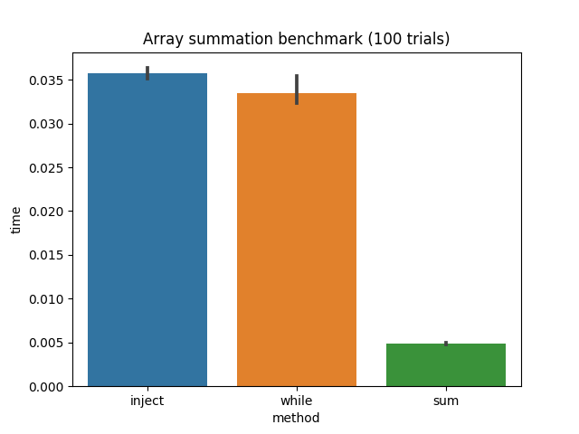
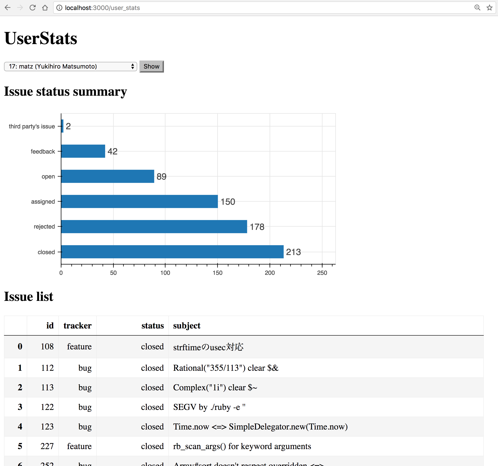
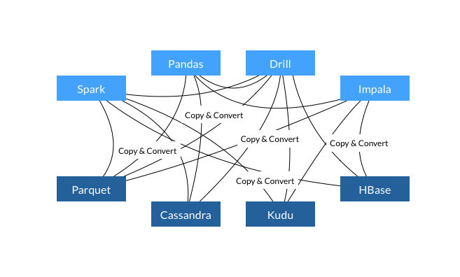
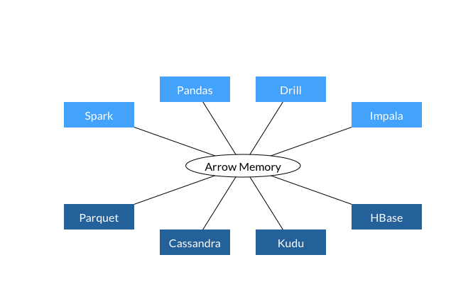

class: title_page, left, middle

# Development of Data Science Ecosystem for Ruby

## Kenta Murata, Speee Inc.
.speee_logo[
]

2017.09.19 RubyKaigi 2017 in Hiroshima Japan

---
class: center, middle

# BigData is important in your business

???
ビッグデータという言葉が一般社会に登場したのが2010年頃ですが、
現在は、大量のデータが実際に至るところで蓄積されていて、それを活用することが事業の成長に欠かせない時代ですね。

---
class: center, middle

# Data Science
# Data Analysis
# Data Aggregation
# Machine Learning

???
皆さんの中にも、お仕事でデータサイエンスとかデータ解析とかデータ集計とか機械学習とか、そういう言い方で特定できることをやってる人がいるのではないでしょうか。

そのようなデータ処理によって大量に蓄積されたデータから何らかの知見を取り出して、意思決定の参考にするわけですね。

---
class: center, middle

# Data Mining

???
いわゆるデータマイニングってやつです。

---
class: center, middle

# Programming Languages for Data Science

???
そういうデータサイエンスの仕事で使うプログラミング言語といえば

---
class: center, middle

# Python
# R
# Scala

???
もっぱら Python とか R とか Scala とかが使われていると思います。皆さんの中にも、RubyKaigi に来てはいるけども、お仕事でデータ解析をするときは Python とか R とか Spark を使っているという人はいるんじゃないでしょうか？私は Python をよく使いますね。

---
class: center, middle

# RubyKaigi 2016 in Kyoto

I stated that Ruby was not practically usable in data science.

???
私は2016年に京都で開催された RubyKaigi で、Ruby はデータサイエンスで使い物にならないプログラミング言語だと言いました。そして、そうなってしまった経緯と、その状態から抜け出してデータサイエンスで使えるようになるには何が必要かを説明しました。

---

# Today's Topics

1. The current situation

   - Now Ruby is practically usable for data science

2. For the future

   - What we should effort to keep Ruby available for data science

3. Request for you

   - Shall we develop our tools and community?

???
今年、この広島では、次の3つのことをお伝えします。

1つ目は現在の話です。実は Ruby は既にデータサイエンスの分野で実用的に使える言語になっています。まずは、この事実について説明します。

2つ目は未来を見据えた話です。Ruby がデータサイエンスの分野で使える状態を将来にも維持するために、私たちは一体何をしていかなければならないのでしょうか。そういった将来の展望についてお話しします。

3つ目は皆さんへのお願いです。RubyKaigi のために広島に来ちゃうくらい Ruby と Rubyists が大好きな私たちで Ruby の可能性を広げていく活動をやっていきましょう、という呼びかけをします。

---

# self.introduce

- Kenta Murata

- @mrkn (github, twitter, etc.)

- Researcher at Speee Inc.

- CRuby committer

- bigdecimal, enumerable-statistics, pycall, etc.

???
その前に、「お前は誰だ？」という人がいるかもしれないので、自己紹介をしておきます。
私の名前は村田賢太といいます。
普段は株式会社 Speee でフルタイムでオープンソースソフトウェアを開発する研究者をしています。
また、CRuby のコミッターもやっていて、bigdecimal という標準ライブラリのメンテナンスをしています。
最近の代表作は enumerable-statistis と pycall です。
そして、最近は特に Ruby でデータサイエンスをできるようしようと頑張っています。

自己紹介はここまでにして、本題に入りましょう。

---
class: center, middle

# The current situation of Ruby<br/>in data science

???
まずは現在の話です。
現在 Ruby はデータサイエンス分野でどんな状況にあるのでしょうか？

---
class: center, middle

# How to use Ruby in data science

???
もし、あなたの会社の Ruby で作られたシステムが結構な金額の利益を上げているとしたら、気軽に Python で書き直すなんてできませんよね。何としても Ruby で作られたシステムにデータ処理の仕組みを乗せる必要があります。そういう時、皆さんはどうしますか？

---
class: left, middle

# The past two options to use Ruby in data science

1. Ruby-only way

2. Use Python and R for data analysis and connect by JSON API

???
これまで、そういう場合に採用できる選択肢は大きく分けて2つありました。
1つ目はRuby だけで頑張る、もう1つはデータ処理部分を Python などで作って JSON API などで繋ぐ、です。

---

# Ruby-only way

- There are large restrictions in data processing parts

- Few capabilities with the existing tools

???
Ruby だけで頑張ろうとすると、データ処理の部分に大きな制約がかかります。これに関しては昨年の RubyKaigi で説明した通り、既存の道具だけでやれることが少なすぎるからです。

---

# Use Python or R together with Ruby

- There are large costs in data exchange by JSON API

    - Development and maintenance of API endpoints

    - JSON serialization for exchanging data

- Letting data processing systems refer the same database of the main application

    - It increases the development cost of the main application

???
一方、Python や R を併用しようとすると、JSON API のためのエンドポイントを作って維持する手間が増えることと、システムのメイン部分とデータ処理部分の間でのデータ交換のコストが発生します。

データ処理システムにメインシステムと同じ DB を見せることもできます。しかし、そうすると、メインシステムとデータ処理システムが強く結合してしまい、データ処理に直接関係ないメインシステムの変更がデータ処理システムに影響を与えてしまう可能性が生じます。

---

# The third option introduced by PyCall

- PyCall allows us to use a Python interpreter together with a Ruby interpreter in the same process.

- PyCall provides low-cost ways of data exchanging.

    - Directly data conversion to Python data types.

    - Sharing the same memory pointers.

    - Use Apache Arrow data structure by red-arrow-pycall library

???
私は、ここに第3の選択肢を提供したくて PyCall を作りました。
PyCall は、Ruby VM と同じプロセス内に Python インタープリタを動かし、Ruby から Python を呼び出せるようにします。
そのため PyCall を使うと、Python を併用しつつも、JSON API を実装する必要がなく、そしてデータ交換のためのコストも極力発生させずに済みます。

---
class: left, middle

# Three options available today

1. Ruby-only way

2. Using Python and R for data analysis, and connect via JSON API or let them look the same DB

3. Use PyCall to call Python from Ruby

???
つまり現在は3つの選択肢があるわけです。これらのうち一番良い選択肢があるわけではなく、状況に応じて最適な選択肢が変化します。これが Ruby の現状です。

---
class: center, middle

# PyCall

???
新しい選択肢である PyCall では、具体的にどんなことができるのでしょうか？
デモを通して見ていきましょう。

---

# For Example:<br/>Use seaborn for visualizing benchmark results

- Measure benchmarking results and collect them in a **pandas** dataframe

- Visualize the results by using **seaborn** that is Python visualization library built on matplotlib

- Perform all the above things in one Ruby script

???
一つ目の例は、Ruby で計測したベンチマークの結果を pandas のデータフレームに集めて、Python の seaborn ライブラリを用いて棒グラフとして可視化する Ruby スクリプトです。

---

```ruby
# Benchmark ================================================
require 'benchmark'
N, L = 100, 1_000_000
ary = Array.new(L) { rand }
methods, times = [], []
N.times do
  methods << :inject
  times   << Benchmark.realtime { ary.inject(:+) }
  methods << :while # ----------------------------------
  times   << Benchmark.realtime {
    sum, i = ary[0], 1
    while i < L
      sum += ary[i]; i += 1
    end
  }
  methods << :sum # ------------------------------------
  times   << Benchmark.realtime { ary.sum }
end

# Make dataframe ===========================================
require 'pandas'
df = Pandas::DataFrame.new(data: { method: methods, time: times })
Pandas.options.display.width = `tput cols`.to_i
puts df.groupby(:method).describe

# Visualization ============================================
require 'matplotlib'
plt = Matplotlib::Pyplot
sns = PyCall.import_module('seaborn')
sns.barplot(x: 'method', y: 'time', data: df)
plt.title("Array summation benchmark (#{N} trials)")
plt.savefig('bench.png', dpi: 100)
```

???
スクリプトはこんな感じです。
終了まで少し時間がかかるスクリプトなので、先に実行してから内容を解説します。

- 配列の総和を求める3種類の方法の実行時間を計測
    - Array#inject, while, Array#sum
    - 配列は、乱数を100万集めたもの
    - 各手法につき 100 回計測する
- 計測結果を pandas のデータフレームにする
- seaborn ライブラリを使って棒グラフを作り、PNG ファイルとして出力
- pandas は Ruby から使いやすくするためのラッパーを用意してあるので、それを使っている
- seaborn はラッパーを作ってないので、そのまま使う
- seaborn は内部で matplotlib を利用して作図しているので、PNG 画像を保存する場合は matplotlib の機能を使う
- matplotlib はラッパーを用意しているので、ラッパーを使う

---
class: middle

```console
$ ruby sum_bench.rb
         time
        count      mean       std       min       25%       50%       75%       max
method
inject  100.0  0.140720  0.020082  0.126592  0.132516  0.135811  0.139753  0.255962
sum     100.0  0.017629  0.001289  0.015933  0.016553  0.017336  0.018437  0.021820
while   100.0  0.126714  0.012356  0.116296  0.121269  0.123295  0.127468  0.213741
```

???
実行すると、標準出力にこのような表が出力されます。
これは、計測結果の要約統計量です。pandas の describe メソッドを使って求めています。

---
class: center, middle

.w80pct[

]

???
そして、実行結果として出力される画像はこんな感じです。
seaborn はとても便利なライブラリで、プログラマが平均とか標準偏差とかを求めず、生の計測結果が入っているデータフレームをそのまま渡してあげるだけで、このような棒グラフを描いてくれます。

そろそろ結果が出ている頃なので、実際の結果を見てみましょう。

---

# Example 2:<br/>Use pandas in Rails app

???
2例目は、pandas を使う Rails アプリです。

ActiveRecord のモデルクラスから pandas のデータフレームを作ります。
そして、先程と同様に seaborn でデータフレームを描画し、その結果をブラウザに返して表示します。

---
class: image_only_page,center,middle




???
こんな感じの画面です。
この Rails アプリは何をやっているか。
まずデータベースは、hsbt こと柴田さんにお願いして作ってもらった7月頃の bugs.ruby-lang.org、つまり redmine の DB スナップショットを見ています。
そのデータから、ruby-trunk プロジェクトのメンバー、大体が Ruby コミッターなんですが、メンバーに assign されている issue の統計情報と一覧表を表示します。

私の Mac で動いているので、まずはどういうアプリなのかを見て見ましょう。

(デモする)
- コンボボックスでユーザを選び、Show ボタンでその人に assign されている issue の情報が出る。
- 棒グラフは、issue のステータス毎に個数を集計した結果。
- 下の表は、issue のリスト。

(デモの後)
画面の下に出ている issue の一覧表は pandas のデータフレームをそのまま html に変換して作っています。
画面の真ん中に置いた棒グラフは、そのデータフレームを seaborn に渡して描画しています。
コードを見て見ましょう。

- まずはコントローラから
- 次はビュー
- そして UserStats モデルの定義を見る

---
class: center,middle

# [https://github.com/mrkn/bugs-viewer-rk2017](https://github.com/mrkn/bugs-viewer-rk2017)

---

# Example 3:<br/>Object recognition by Keras

- Detecting bboxes of objects in a photo
- Keras's model of SSD300

???
最後は、最近流行りの物体検出です。

写真に写っている物体を検出して、その位置をマーキングします。

画像内の物体検出のために Keras という深層学習フレームワークのモデルを使います。
また、検出された物体の位置をマーキングするために matplotlib を使います。

---
class: center, middle

# PyCall makes Ruby easily usable for<br/>data manipuration,<br/>data visualization,<br/>and machine learning

???
このように、今まで Ruby でやりにくかったデータの整形や可視化、まったくできなかった機械学習・深層学習が、どれも PyCall によって可能になりました。

---
class: center, middle

# Python is a best friend of Ruby from now on

???
だから、今後は、Python は Ruby のベストフレンドになります。
Ruby から Python のツールを呼び出すことに対して、違和感を覚える人がいるかもしれません。その違和感は、おそらくなんの根拠もないただの先入観なので忘れてください。たまたま、皆さんのお仕事に使える便利なツールが Python 向けに作られていただけです。

大事なことなのでもう一度言います。Python 向けに作られているからといって、それを Ruby から使うことは全く不自然ではありません。
皆さんは nokogiri というライブラリを何度も使ったことがあるんじゃないでしょうか？あのライブラリは Ruby 向けに作られていますが、一番重要な部分は libxml という C で書かれたライブラリのラッパーです。

同じことが PyCall にも言えます。PyCall 経由で Ruby から pandas を使うことに違和感があるのだとしたら、こう考えて見てください。pandas は Python むけに作られているライブラリなんですが、あいつの一番重要な部分は Cython という C 言語の方言で書かれています。

---
class: center, middle

# In fact, PyCall is just a wrapper library of libpython that is written in C language

???
そして、PyCall 自身も、libpython という C 言語で書かれたライブラリのラッパーなんです。皆さんが、mysql2 とか pg のように、C で書かれたライブラリのラッパーになっている gem を使うことに違和感を感じないのだとしたら、PyCall もおそらく違和感を感じずに使えるはずです。

---
class: center, middle

# Try PyCall

???
なので、ぜひ PyCall を試してみてください。

---
class: center, middle

# PyCall is too young
## so it needs to be applied for various use cases

???
ただし、PyCall は最近やっとバージョン 1.0 をリリースできたばかりです。おそらく、皆さんが PyCall でやりたい事のうち、できないことが確実に存在します。例えば、すでに Chainer のバージョン 2.0 が PyCall 経由で使えないことが分かっています。Chainer に関しては私が調査を始めていて、おそらくすぐ使えるようになると思います。

他にも Chainer のようなケースがあると思います。
だから、多くの人に PyCall を試していただいて、できないことを明らかにして頂きたいです。

---
class: center, middle

# [https://github.com/mrkn/pycall.rb](https://github.com/mrkn/pycall.rb)

???
問題が見つかったら、github リポジトリに issue を登録してください。

---
class: center, middle

# Ask me if you want to try PyCall in your business

???
また、仕事で使ってみたいという方がいたら、私まで直接お声がけください。

---
class: center, middle

???
ちょっと間をおく

---
class: left, middle

# Three options (again)

1. Ruby-only way

2. Using Python and R for data analysis, and connect via JSON API or let them look the same DB

3. Use PyCall to call Python from Ruby

???
Ruby でデータサイエンスをするときに現在取りうる3つの選択肢をもう一度振り返りましょう。
私は先ほど、これらのうちどれが一番良いか？が状況に応じて変わるといいました。
これは現在は正しいですが、将来的にもこれが正しいままというのは個人的には良く無いなと思います。

というのも、Python で同じ選択肢を出すと1個減るんですね。

---
class: left, middle

# Python's case: only two options

1. Python-only way, that is **best** practice

2. Use R **only** for statistical analysis methods that are unavailable in Python

    - We can use Rpy2 for this case

???
Python では、基本的に Python のみでやるのが一番良いと思います。
でも、Python では対応できない統計解析手法が結構あります。そのような統計解析手法が必要な時は、ほとんどの場合 R にリファレンス実装があるので、それを使うことになります。こういう場合だけ第2の選択肢が発生します。R を使う場合、Python には rpy2 という PyCall のような仕組みのブリッジがあるので、それを使えます。

---
class: center, middle

# Python can be easily used for almost all situations in data science

???
Python で Python-only のやり方が最も良いのは、大体のことが Python で簡単にできるからです。
逆に、大体のことが Ruby で簡単にはできないから、Ruby では PyCall という第3の選択肢が意味を持つわけです。PyCall のようなものは私が一人で1年未満で作れるくらいなので結構コストパフォーマンスが良い仕組みだと思うんですが、未来永劫 Python を下働きさせないと Ruby でデータサイエンスができないっていうのは嫌ですよね。

---
class: center, middle

# PyCall should be a temporary way until Ruby will get ready for data science

???
つまり、PyCall は、Ruby がデータサイエンスで使えるようになるまでの一時的な手段であって欲しいわけです。
だから、今はとりあえず現場では PyCall を使っておいて、少し先の未来を見据えて Ruby のための仕組みを作っていきたいのです。

---
class: center, middle

# Look ahead to the near future

???
この「少し先の未来を見据えて」というところが非常に重要です。闇雲にやって時代遅れものを作っても仕方ないですからね。

そんな、少し先の未来を見据えて動き始めているプロジェクトが既に存在します。

---
class: center, middle

# Red Data Tools project
## https://red-data-tools.github.io/

???
それが Red Data Tools プロジェクトです。

PyCall は、Python のツールを Ruby から使えるようにしようっていう、すごく近視眼的なアプローチです。

Red Data Tools は違います。このプロジェクトは、未来をきちんと見据えて、現在取るべき最善のアプローチを選んでいます。

その最善のアプローチとは、Apache Arrow です。

---
class: center, middle

# Apache Arrow


???
Apache Arrow はこういうロゴのプロジェクトです。

このロゴを見せられても訳がわからんと思いますので、ちゃんと説明します。

---
class: center, middle

# Exchanging data between multiple systems<br/>in data science

## E.g. Data extraction from RDBMS to client programs

???
一般に、データサイエンスでは、複数のシステム間でデータのやりとりが発生します。
例えば、リレーショナルデータベースからデータを取り出すとき、DBMS からクライアントプログラムへデータの移動が発生します。

---

# The current way to exchange data between systems

- Each system has its own internal memory format

- Serialize and deserialize for exchanging data wasted a lot of CPU time

- Similar functions are implemented in multiple systems

???
このようなデータ交換の現在のやり方は、ここに示す3つのよくない特徴があります。
1つ目は、各システムが独自の内部メモリフォーマットを採用してデータを扱っていることです。
2つ目は、データ交換のための変換処理に多くの CPU 時間を費やしてしまうことです。
そして3つ目は、複数のシステムが似たような機能をそれぞれ実装していることです。

この状況を図にするとこんな感じです。

---
class: center, middle

# The current situation of data exchanging



???
このように、新しいシステムが増えるたびに同時に使う必要がある他のシステムへの Copy & Convert のエッジが増えていきます。

Apache Arrow はこのような現状を次のように解決します。

---
class: center, middle

# The near future with Apache Arrow



???
このように、全てのシステムが内部メモリ表現として Apache Arrow を採用することで、データ交換やデータ処理において発生していた無駄が解消されます。

このような魅力的な未来を実現するため、Apache Arrow は精力的に開発が続けられています。

---
class: center, middle

# The future in which Ruby can be used with Apache Arrow

???
Ruby が Apache Arrow に対応すれば、他の Apache Arrow に対応したシステムと低コストでデータ交換ができるようになります。

Apache Arrow に対応するには、Apache Arrow へのバインディングを作れば良いわけです。

Apache Arrow のバインディングをひとつ作るだけで、他の多くのシステムと相互接続できるようになるなんて魅力的ですよね。

実は、Ruby 用の Apache Arrow バインディングはもう存在しています。

---
class: center, middle

# Red Arrow

## https://github.com/red-data-tools/red-arrow

???
Red Arrow です。

---

# Red Data Tools products

- red-arrow
- red-chainer
- red-arrow-pycall
- red-arrow-numo-narray
- red-arrow-nmatrix
- red-arrow-activerecord
- etc.

---

# Big News in Red Data Tools

???
Red Data Tools に関する大ニュースがあります。

--

- Kouhei Sutou (@kou) officially became a member of PMC (project management committie) of Apache Arrow **yesterday**

???
昨日付けで、須藤さん、test-unit とか ruby-gnome2 とかで有名な Ruby コミッターの須藤さんが、Apache Arrow の project management committee のメンバーになりました。

須藤さんに拍手。

これは非常にめでたいことです。

--

- This means there is at least one person who develops Ruby-support of Apache Arrow as a core developer

- So you will be able to use Apache Arrow's new feature ASAP

???
これは、少なくとも一人、Apache Arrow のコアメンバーが Ruby サポートを開発しているということです。

つまり、皆さんは、Apache Arrow に新機能が実装されたら、いち早く Ruby から試せるんですよ。これすごいですよね、やばくないすか？

---
class: center, middle

# Join Red Data Tools

## There are gitter channels both in English and Japanese

### https://gitter.im/red-data-tools/en
### https://gitter.im/red-data-tools/ja

---

# Summary

- Ruby has already been a programming language that is usable in data science

- You can use Python tools from Ruby by using PyCall as demonstrations I performed in this talk

- Red Data Tools enables us to use Apache Arrow and it guarantees that Ruby will be connected to multiple data processing systems in the future

- But there are lots of things should be done for the future

---

# Requests for you

- Try PyCall to make real-world use cases, and find bugs

- Join Red Data Tools to contribute the future of Ruby in data science

- Join the workshop tomorrow

???
台風の中を広島まで来てしまうくらい Ruby が大好きな皆さんへのリクエストは3つ。

1つ目は PyCall を試してみてください。リアルなユースケースを作りたいし、いろんな使い方をしていただいてバグを見つけたいです。よろしくお願いします。

2つ目は、未来の Ruby のために Red Data Tools に参加してください。まだアクティブメンバーは数名しかいません。開発、ドキュメンテーション、インストールしてみる、使ってみる、など人手で色々試したいことが沢山あります。

最後のリクエストは、明日のワークショップに参加してください。

---

# RubyData Workshop in RubyKaigi 2017

13:50-15:50 in Room Ran

## https://github.com/RubyData/rubykaigi2017

# 1. PyCall Lecture

# 2. Getting started to Red Data Tools project

???
明日、13:50 から Room Ran にて、RubyData ワークショップをやります。

内容は2つありまして、1つ目は PyCall の詳しい解説です。Jupyter Notebook 形式の講義資料を使います。この URL の github リポジトリの README を開いて、この3つのコマンドを実行すると準備完了なので、明日のワークショップまでにやっておいてくださいね。

そして、2つ目は Red Data Tools の紹介です。Red Data Tools をまとめている須藤さんと、Red Chainer の開発を進めている株式会社 Speee の畑中さんが Red Data Tools が目指していることや今できることなどを解説してくれます。

広島で PyCall と Red Data Tools の話が聞けるまたとないチャンスなので是非ご来場ください。

---


