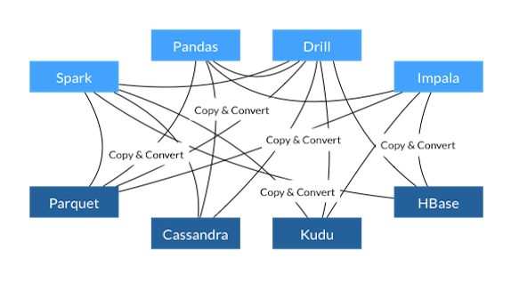
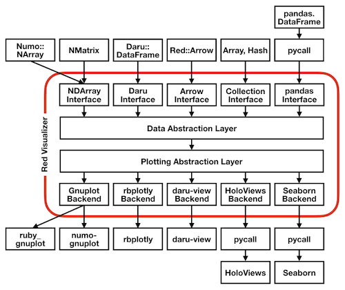

# Apache Arrow できりひらく Ruby の未来

Kenta Murata
Speee, Inc.

2019.10.24
銀座Rails #14

---

# self.introduction

- Kenta Murata
- Full-time OSS developer at Speee, Inc.
- Apache Arrow committer
- CRuby committer
- pycall, charty, enumerable-statistics, bigdecimal, etc.

---

# Contents

1. Apache Arrow の全体像
2. Apache Arrow と Ruby
3. Rubyist が Apache Arrow に注目すべき理由
4. Red Data Tools のご案内
5. まとめ

---
<!-- _class: invert -->
# Apache Arrow の全体像

---

# Apache Arrow とは？

- 数年後にデータ処理分野で重要な要素になっている予定のプロジェクト
- メモリ上に大量のデータを置いて処理をするシステムに対して、データ操作の基本機能を供給する
- 2016年に開発が始まり、今年の12月頃にバージョン 1.0 がリリースされる予定

---

# Apache Arrow の全体像

- Apache Arrow が目指す世界
- Apache Arrow の対応プログラミング言語
- Apache Arrow の構成要素

---

# Apache Arrow が目指す世界

- メモリ上の大量データを効率よく処理できる世界
	- いまは無駄が多く効率が悪い！
- 効率化の方法
	1. 速度の効率化
	2. 実装コストの効率化

---

# Apache Arrow が目指す「速度の効率化」

- データ交換の無駄を取り除く
- データ処理の高速化

---

# データ交換における無駄

- シリアライズ、デシリアライズ
- フォーマット変換
- コピー

これらを無くすことで、データ交換が速くなる！

---

# データ交換の無駄を取り除く方法 (1)

- シリアライズとデシリアライズのコストが小さいフォーマットを採用
- パースしなくても読み込めるフォーマット == FlatBuffers
- mmap で読み書きできるので高速

---

# データ交換の無駄を取り除く方法 (2)

- たくさんのプログラミング言語を共通フォーマットに対応させてフォーマット変換を不要にする
- メモリ上のデータをそのまま送受信すれば良い
- mmap や共有メモリを利用することでプロセス間でのデータ共有がゼロコストになる

---

# データ処理の高速化

- 高速化の手段
	- 1つのデータを高速に処理する
	- 複数のデータを同時に処理する
- メモリ上のデータレイアウトを工夫する

---

# データレイアウトの工夫

- 2種類の工夫
	- CPU キャッシュに多くのデータが載るように、メモリ上でデータを局所化する
	- CPU の SIMD 命令を使って一度に複数の値を処理できるようにデータのアライメントを調整する
- これらを実現するため、Apache Arrow は列指向フォーマットを採用している

---

# 行指向と列指向

---

# 「速度の効率化」のまとめ

- データ交換の無駄を取り除くために、シリアライズとデシリアライズをほぼゼロコストにする
- データ処理を高速化するために列指向フォーマットを採用し、メモリ上のデータレイアウトを工夫する

---

# Apache Arrow が目指す「実装コストの効率化」

- Apache Arrow がインフラとなり、メモリ上のデータ処理に必要な機能を提供する
- 現在さまざまなシステムが独自に実装している基本機能や効率化のための工夫は Apache Arrow が担当する
- 各システムは独自で必要なものの実装に集中できる

---

# 無駄と制限がある現在の様子

- 各システムが独自フォーマットを使用
- シリアライズとデシリアライズで70〜80%の計算時間を浪費
- 各システムが類似した機能セットを独自実装

---

# Apache Arrow によって実現する世界

- 全システムが共通のメモリフォーマットを使用
- システム間の通信でオーバーヘッドがない
- 共通機能の実装を共有できる
	- 例: Parquet ファイルの入出力

---

# Apache Arrow の対応プログラミング言語

- 11言語に公式対応 (対応レベルは言語に依存)
- ネイティブ実装
	- C++, C#, Go, Java, JavaScript, Rust
- C++ API のバインディング
	- C (GLib), MATLAB, Python, R
- C (GLib) API のバインディング
	- Ruby

---

# Apache Arrow の構成要素

- Apache Arrow フォーマット
- Apache Arrow のライブラリ群
- Apache Arrow に対応したサードパーティ製のシステム

---

# Apache Arrow フォーマット

- データのメモリ上のレイアウトを規定
	- 値の種類と表現
	- 配列データ
	- 表データ
	- テンソル

---

# Apache Arrow が扱える値

- 真偽値 (1bit)
- 整数
	- 8bit, 16bit, 32bit, 64bit
	- それぞれ符号付きと符号なし
- 2進浮動小数点数
	- 16bit (half), 32bit (float), 64bit (double)
- 10進小数 (桁数と精度を指定)
	- Ruby の BigDecimal みたいなやつ

---

# Apache Arrow が扱える値 (続き)

- 日付
	- UNIXエポックからの経過日数 (32bit)
	- UNIXエポックからの経過ミリ秒数 (64bit)
- 時刻
	- 深夜0時からの経過時間
	- 単位は秒 (32bit)、ミリ秒 (32bit)、マイクロ秒 (64bit)、ナノ秒 (64bit) を選べる
- タイムスタンプ
	- 64bit
	- UNIXエポックからの経過時間
	- 単位は秒、ミリ秒、マイクロ秒、ナノ秒を選べる

---

# Apache Arrow が扱える値 (続き)

- 文字列とBLOB
	- 可変長 UTF-8 文字列
	- 可変長 BLOB
	- 固定長 BLOB

---

# Apache Arrow の配列型

- すべての要素が同じ型の値を持つ
- メモリ上の連続した領域を使用する
- 任意の要素に NULL (Ruby では `nil`) を入れられる
	- NULL の位置をビットマップで管理する
- 次の複合型配列にも対応
	- リスト配列
	- 構造体配列
	- 共用体配列
	- 辞書配列

---

# リスト配列

- 配列の各要素が0個以上の同じ型の値を持つ
- Ruby では入れ子の Array として表現できる
  (注意：Ruby の Array は値の型を制限できない)

---

# 構造体配列

- 配列の各要素が1つ以上のフィールドを持つ
- 各フィールドは異なる型の値を持てる
- 構造体、リスト、共用体もフィールドにできる

---

# 共用体配列

- 配列の各要素が1つ以上のフィールドを持つ
- 各フィールドは異なる型の値を持てる
- 構造体、リスト、共用体もフィールドにできる
- 構造体とは異なり、どれか1つのフィールドのみに値を入れられる

---

# 辞書配列

- カテゴリ値 (a.k.a. 名義尺度データ) の配列
- 辞書とそのインデックス配列の2つの配列で構成される
	- 辞書は文字列の配列
	- インデックス配列は整数の配列
	- インデックス配列の要素は、辞書の要素の位置を表す
- 例: `["a", "a", "b", "c", "b"]` を辞書配列で表すと
	- 辞書: `["a", "b", "c"]`
	- インデックス配列: `[0, 0, 1, 2, 1]`

---

# 配列データのメモリ上のレイアウト

- 要素が固定長の場合
	- 要素のサイズ (バイト数) を $s$、配列の長さを $n$ とするとき、$s \times n$ バイトのメモリ領域の先頭を第0要素とし、その隣を第1要素、・・・と配置する
	- 要素のサイズを $s$ とすると、第 $i$ 番目の要素の位置は $i \times s$ で求められる

---

# 配列データのメモリ上のレイアウト (続き)

- 要素が可変長の場合
	- 値を並べるバイト配列と、値の開始位置 (オフセットという) を並べる整数配列をそれぞれ用意する
	- 値は値用配列の先頭から順に隙間なく詰めていく
	- 第 $i$ 番目の要素の値の先頭の位置は、オフセット用配列の第 $i$ 番目の値 $\mathrm{offset}(i)$ で得られる
	- 第 $i$ 番目の要素の長さ $\mathrm{size}(i)$ は次式で得られる
	  $$\mathrm{size}(i) = \mathrm{offset}(i+1) - \mathrm{offset}(i)$$
	- オフセット用配列は $n+1$ 個の要素を持つ

---

# 可変長要素の配列の例: 文字列の配列

- `["C++", "C", "Ruby", "Python"]` の場合
	- 値用バイト配列: `"C++CRubyPython"`
	- オフセット配列: `[0, 3, 4, 8, 14]`
- `["a", "", "", "bb", "ccc"]` の場合
	- 値用バイト配列: `"abbccc"`
	- オフセット配列: `[0, 1, 1, 1, 3, 6]`

- このように配列を表現することで、値が可変長であっても値へアクセスするためのコストが小さくなる
- 値をすべて1列に並べているため無駄なメモリ消費もない

---

# Ruby の配列の場合

- `["C++", "C", "Ruby", "Pytohn"]` は Ruby では、5つのオブジェクトから構成される
- 各文字列は27バイト以下の長さであればオブジェクト (40バイト) に埋め込まれ、そうでなければヒープ領域内の文字列自身の長さより大きい容量のメモリ領域に配置される
- 配列は長さ3以下ならオブジェクトに埋め込まれ、そうでなければヒープ領域内の大きめのメモリ領域に配置される
- Ruby の配列を使うと、メモリアクセスは局所化されにくくなり、余分なメモリ消費も発生しやすい

---

# Apache Arrow の表データ

- 所謂データフレームの内部構造に相当する
- スキーマとレコードバッチの組み合わせが最小単位
- 1つ以上のレコードバッチを繋げたものとスキーマの組み合わせが Apache Arrow の表データ

---

# スキーマ

- スキーマはフィールドのリスト
- フィールドは値の型とフィールド名の組
- 第 $i$ 番目のフィールドが、表の第 $i$ 列目に対応する

---

# レコードバッチ

- スキーマ + 配列のリスト
- 各配列は表の列に対応
- すべての配列が同じ長さ

---

# 表 = レコードバッチのリスト

- 表は、複数のレコードバッチを集めたもの
- つまり、表の各列は複数の配列を __論理的に__ 繋げたもの
- レコードバッチ内の配列一つ一つはメモリ上の連続した領域を占めているが、表の列全体がメモリ上で連続した領域を占めている必要はない

---

# 表データの構造図

---

# 表を複数のレコードバッチに分ける理由

- 大きな表を複数レコードバッチに小分けにすると嬉しいことがある
- 個々のレコードバッチを並列に構築して、最後に1つの表にまとめる方法で、表の構築を高速化できる
	- 例: RDBMS から1日分のデータを取得する場合、1時間ごとのレコードバッチに分ければ、全体を24個に分割して並列処理が可能
- 表全体に対するデータ処理をレコードバッチ単位の分割統治法による処理に分解して並列化できる
- 表をインクリメンタルに作る際にも、全体を `realloc` する方法より効率的にできる

---

# Apache Arrow のテンソル

- テンソル
	- スカラー、ベクトル、行列を多次元に一般化したもの
	- すべての値が同じ型の多次元数値配列
- 疎テンソル
	- ほとんどの要素がゼロのテンソル
	- ゼロではない値だけを効率よく管理
- numo-narray、numpy、scipy などの数値計算用ライブラリが扱うデータ構造も Apache Arrow を利用して交換できる
- Apache Arrow の疎テンソルは、フォーマットの提案からC++ APIの実装までを私がやっている

---

# Apache Arrow フォーマット (まとめ)

- 大量データのメモリ上のレイアウトを規定
	- 値の種類と表現
	- 配列データの持ち方
	- 表データの持ち方
	- テンソル

---

# Apache Arrow のライブラリ

- Arrow
- Gandiva
- Parquet
- Flight
- Datasets
- Query Engine (計画中)
- Data Frame (計画中)

---

# Apache Arrow のライブラリ (続き1)

- Arrow
	- 基本データ構造とその操作を提供
	- CPUでの配列に対する基本演算機能の提供

---

# Apache Arrow のライブラリ (続き2)

- Gandiva
	- Arrow の配列に対する高度な演算処理を定義して効率よく実行する仕組みの提供
	- LLVM IR を利用して、CPU や GPU に最適化されたコードを生成する

---

# Apache Arrow のライブラリ (続き3)

- Parquet
	- ディスク上で効率よく入出力できる列指向のデータフォーマット
	- すぐ捨てる揮発データをディスクに書き出す場合は Arrow フォーマットをそのまま書き出すと良い
	- 長期間保管する用途でディスク領域を効率よく使い、かつ入出力も効率よくやりたい場合に Parquet は向いている

---

# Apache Arrow のライブラリ (続き4)

- Flight
	- RPC で Arrow フォーマットの大きなデータをやり取りするためのプロトコル
	- いまのところ gRPC 上で使えるように開発されている
	- gRPC に依存しているわけではない

---

# Apache Arrow のライブラリ (続き5)

- Datasets
	- 高度なデータソースから Arrow フォーマットでデータを読み出す機能を提供
	- ローカルファイルシステム、Amazon S3 のようなクラウド上のストレージ、各種 RDBM に対応しようとしている
	- 複数のファイルに分割されたデータセットを論理的に1つのデータセットとして扱う機能
	- 複数種類のストレージから読み出されるデータを統合して扱う機能

---

# Apache Arrow のライブラリ (続き6)

- Query Engine (計画中)
	- Datasets で定義されるデータソースや、メモリ上のレコードバッチを対象に、高度なクエリを発行して結果をレコードバッチとして構築する機能を提供
	- クエリは SQL で書けるようになる予定
	- 12月の Apache Arrow Tokyo Meetup (後述) で詳しく紹介する

---

# Apache Arrow のライブラリ (続き7)

- Data Frame (計画中)
	- pandas が提供するような所謂データフレームと呼ばれるデータ構造と、それを対象としたデータ解析用の機能を提供する
	- Arrow のレコードバッチは基本的に読み込み専用で設計されているが、Data Frame が提供する表データは効率的かつ安全な書き換えにも対応する
	- 12月の Apache Arrow Tokyo Meetup (後述) で詳しく紹介する

---
<!-- _class: invert -->
# Apache Arrow と Ruby

---

# Apache Arrow と Ruby

- Apache Arrow Ruby API
	- GObject Introspection を利用して C GLib API から Ruby 用のバインディングを自動生成
	- 加えて、Rubyists が便利に使えるようなインターフェイスを追加
	- numo-narray や pycall.rb などと連携するためのライブラリも提供

---

# Ruby API の対応状況

- よく対応できているもの
	- Arrow
	- Parquet
- 鋭意対応中のもの
	- Gandiva
- これから頑張っていきたい
	- Datasets
- C++ API の開発待ち
	- Query Engine
	- Data Frame

---

# Ruby API の開発メンバー

- Kouhei Sutou
	- PMC なので色々やっている
- @shiro615
	- C++ API の進捗に応じて、C GLib API と Ruby API を次々と対応している
- Kenta Murata (Me)
	- C++ API の Sparse Tensor の主要開発者
	- C GLib API と Ruby API をごく稀にいじる
	- Data Frame をやりたいと思っている
- 3名とも Red Data Tools のメンバー

---
<!-- _class: invert -->
# Rubyists が Apache Arrow に注目すべき理由

---

# Rubyists が Apache Arrow に注目すべき理由

- Datasets と Query Engine によって可能になること
- Arrow Data Frame によって可能になること

---

# Arrow Datasets と Query Engine によって可能になること

- Datasets によって RDBMS から直接 Arrow フォーマットでクエリの結果を受け取れる
- Query Engine によってメモリ上のデータをソースとしてクエリを発行できる

## この2つの要素を応用することで、Rails アプリケーションにとって嬉しいことが起きる

---

# ふりかえり: RubyKaigi 2019 での発表

- mysql2 の内部で Apache Arrow を使う実験をした
- もともと libmysqlclient のデータ構造から Ruby の入れ子 Array 形式へ変換していた処理を、__Arrow RecordBatch__ へ変換する処理で置き換えた
- 変換処理は Ruby インタープリタに依存していないため、__GIL を手放して__ して実行する
- その結果、__フォーマットへ変換のための作業用メモリの分だけメモリ消費量が増えた__
- 一方、変換処理を並列実行できるようになったため、__同時に複数のクエリを発行した場合の高速化が実現できた__

---

# (再掲) Arrow Datasets と Query Engine によって可能になること

- Datasets によって RDBMS から直接 Arrow フォーマットでクエリの結果を受け取れる
- Query Engine によってメモリ上のデータをソースとしてクエリを発行できる

---

# Arrow RecordBatch を ActiveRecord の内部データとする

- 全行程で Arrow フォーマットを使うので変換が不要に
	- 実験で発生した作業用メモリの増加がなくなるはず！
	- 変換処理に要していた時間もなくなって速くなるはず！
	- RDBMS へのクエリ発行の直前から Arrow RecordBatch を取得するまでずっと GIL を解放できる！
- Arrow RecordBatch を ActiveRecord のデータソースに
	- AR::Relation に対する副次クエリが効率よくなるはず！
	- データのとり方次第でRDBMSの負荷を減らせるはず！

---

# Data Frame によって可能になること

- Ruby でも実用的なデータフレームが使えるようになる
- データフレームを利用した高度なデータ分析ができるようになる
- データ処理機能は C++ で実装されている
	- 高速に処理される
	- 並列に実行できる
- 後述する Charty と組み合わせることで、高度なデータ可視化も容易に実現できる
- Ruby もデータ解析を実践できるプログラミング言語になる！

---

# Charty

- Ruby 用のデータ可視化ライブラリ
- データ構造の抽象化レイヤと可視化処理の抽象化レイヤを持ち、様々なデータを様々な方法で可視化できる 
  例:
	1. ActiveRecord のデータを matplotlib で可視化する
	2. CSV ファイルを読み込んで plotly.js で可視化する
- 可視化 API は seaborn を参考に、高水準なインターフェイスを提供するよう設計している
- Red Data Tools プロジェクトで開発している
	- https://github.com/red-data-tools/charty

---

# Charty の内部設計

---

# Charty の可視化例

- matplotlib の例
	- https://nbviewer.jupyter.org/gist/mrkn/3837b2fba3fda0779feb8421cdc516dc
- plotly.js の例
	- https://nbviewer.jupyter.org/gist/mrkn/ba3605601fa696a6eda68dd8fe589a11

---
<!-- _class: invert -->
# Red Data Tools のご案内

---

# Red Data Tools

- Ruby でデータ処理できる世界を目指してツールを開発している人々の集まり
- https://red-data-tools.github.io/ja/
- 6つのポリシー (後述) に従っている
- Speee ラウンジ (六本木) に来れる人が集まる機会が月1回ある
- ふだんは Gitter で必要なときに話をする
  - https://gitter.im/red-data-tools/ja

---

# Red Data Tools のポリシー

1. Rubyコミュニティーを超えて協力する
2. 非難することよりも手を動かすことが大事
3. 一回だけの活発な活動よりも小さくてもいいので継続的に活動することが大事
4. 現時点での知識不足は問題ではない
5. 部外者からの非難は気にしない
6. 楽しくやろう！

---

# 次回の集まり

- https://speee.connpass.com/event/151636/
- 日時: 11/19 (Tue) 19:00〜21:30
- 場所: Speee ラウンジ (黒崎ビル4F)

---

# Apache Arrow Tokyo Meetup 2019

- 12/11 (Thu) 19:00〜
- 場所: Speee ラウンジ (黒崎ビル4F)
- もうすぐ Apache Arrow 1.0 がリリースされて、Arrow フォーマット 1.0の仕様がフリーズされる
- Apache Arrow を使い始める絶好のタイミング
- Apache Arrow のユーザにとって有用な情報、Apache Arrow を使ってみたいと思えるような情報をみなさんにお届けする
- もうすぐ Speee の connpass 上でアナウンスされる
  - https://speee.connpass.com/

---
<!-- _class: invert -->
# まとめ

- Apache Arrow はメモリ上の大量データ処理を効率化する
- もうすぐ Apache Arrow 1.0 がリリースされて、Arrow フォーマット 1.0の仕様がフリーズされる
- Apache Arrow を使い始める絶好のタイミング
- Apache Arrow Ruby API の開発を進めることで Ruby でデータ処理ができる世界が実現できる
- さらに Rails アプリケーションにとって嬉しい要素もある
- Red Data Tools に参加して Ruby コミュニティ内でも Apache Arrow を盛り上げて行きましょう
